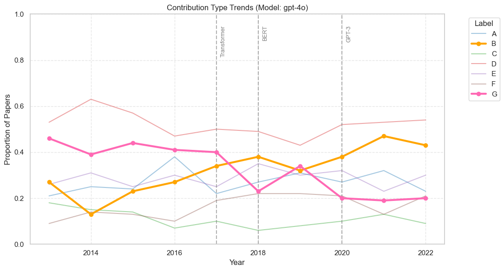
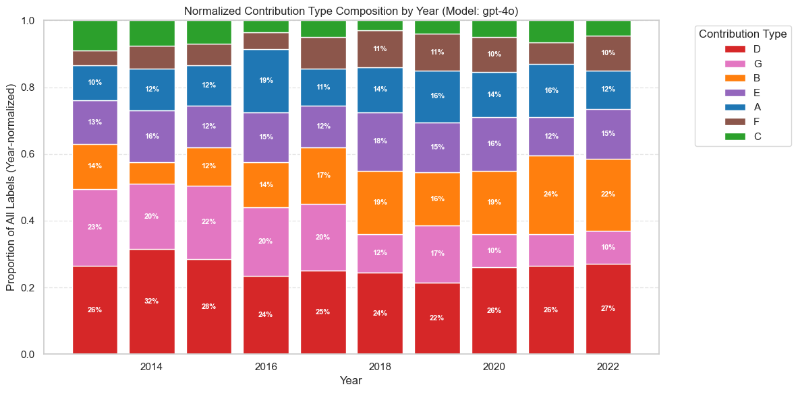

# Studying Contribution Types of Research in Natural Language Processing

*A final project for **EN.601.672 — Natural Language Processing for Computational Social Science (Spring 2025).***

**Authors:** Krirk Nirunwiroj ([knirunw1@jh.edu](mailto:knirunw1@jh.edu)), Niyati Bafna ([nbafna1@jh.edu](mailto:nbafna1@jh.edu))

We investigate how **Contribution Types** of ACL papers evolved over a **10‑year window (2013 – 2022)**.  Each abstract is annotated with a seven‑way taxonomy (A–G) using **Azure OpenAI GPT‑4o**; we then analyse longitudinal trends.

---

## 1  Contribution Types & Examples

| Key   |                                                             Colour                                                             | Description                                    | Example Paper                                                      |
| ----- | :----------------------------------------------------------------------------------------------------------------------------: | ---------------------------------------------- | ------------------------------------------------------------------ |
| **A** | `#1f77b4` | New task or dataset                            | *Khanuja et al.* (2024): Creating a new task dataset focusing on cultural adaptation of images.        |
| **B** | `#ff7f0e` | New model architecture or engineering practice | *Devlin et al.* (2019): Introducing BERT!                                  |
| **C** | `#2ca02c` | New algorithm or mathematical innovation       | *Zheng et al.* (2021): Increasing tokenizer vocabulary in an efficient way with KNN sampling. |
| **D** | `#d62728` | New strategy using existing techniques         | *Dimakis et al.* (2024): Applying in-context learning techniques to boost low-resource performance.     |
| **E** | `#9467bd` | Insights on existing data or languages         | *Melgarejo et al.* (2022): (Among other things) Compares Quechua to Spanish using WordNets.           |
| **F** | `#8c564b` | Insights on existing models                    | *Robinson et al.* (2023): Evaluating ChatGPT for low-resource machine translation.  |
| **G** | `#e377c2` | Application of existing techniques to new data | *Lin & Su* (2021).  |

*(Colour palette is used consistently across all plots.)*

---

## 2  Repository Layout & Codebase Overview

```
├── data/                       # Raw & processed Parquet files
│   ├─ acl-publication-info.64k.parquet
│   ├─ acl-publication-info.main.parquet
│   ├─ acl-publication-info.machine-translation.parquet
│   ├─ acl-publication-info.main.yearlysampled100.parquet
│   └─ acl-publication-info.machine-translation.yearlysampled100.parquet
│
├── scripts/
│   ├─ azure_openai.py            # async, ≤300 RPM Azure client
│   ├─ preprocess.py              # filtering + yearly sampling
│   ├─ label_contributions.py     # GPT‑4o annotation pipeline
│   ├─ run_experiments.py         # batch runner for 2013‑2022
│   └─ prompt_template.txt        # zero‑shot prompt
│
├── result/      # CSV / Parquet outputs (all / main / MT)
├── figures/     # Auto‑generated visualisations
└── notebooks/   # Exploration & plotting
```

---

## 3  Setup & Data Preparation

### 3.1  Environment

```bash
conda create -n nlp4css_contrib python=3.11
conda activate nlp4css_contrib
pip install -r requirements.txt
```

*(Alternatively use `python -m venv .venv`.)*

### 3.2  Dataset download

Manually download **acl-publication-info.74k.v2.parquet** from the [ACL‑OCL HuggingFace page](https://huggingface.co/datasets/WINGNUS/ACL-OCL) and place it in `data/`.

### 3.3  Pre‑processing

```bash
python scripts/preprocess.py \
  --input  data/acl-publication-info.74k.v2.parquet \
  --output data/acl-publication-info.64k.parquet
```

Generates the five filtered/sampled Parquet files listed above.

### 3.4  Azure OpenAI credentials

Create `.env` with endpoint, version, and key—see template in the repo.

---

## 4  Annotation Pipeline

### Single‑year example

```bash
python scripts/label_contributions.py \
  --input  data/acl-publication-info.64k.parquet \
  --model  gpt-4o \
  --year   2021 \
  --sample 100
```

### Batch experiment (2013‑2022)

Edit `scripts/run_experiments.py` to switch `INPUT_PATH` between **all**, **main**, or **MT** datasets (see commented lines) and run:

```bash
python scripts/run_experiments.py
```

---

## 5  Visualisation & Report

Below are the example figures (already exported to **`figures/`**).

| Figure                                     | Description                                                                                                 |
| ------------------------------------------ | ----------------------------------------------------------------------------------------------------------- |
|  | Contribution‑Type trend (2013‑2022) — label **B** highlighted; Transformer/BERT/GPT‑3 milestones annotated. |
|     | Normalised composition of Contribution Types per year.                                                      |

Open **`notebooks/result_analysis.ipynb`** to regenerate or customise plots.

The full write‑up with methodology and discussion is in **`final_report.pdf`**.

---
